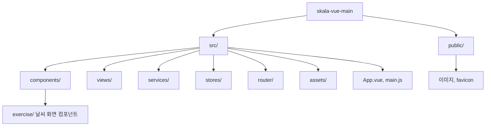
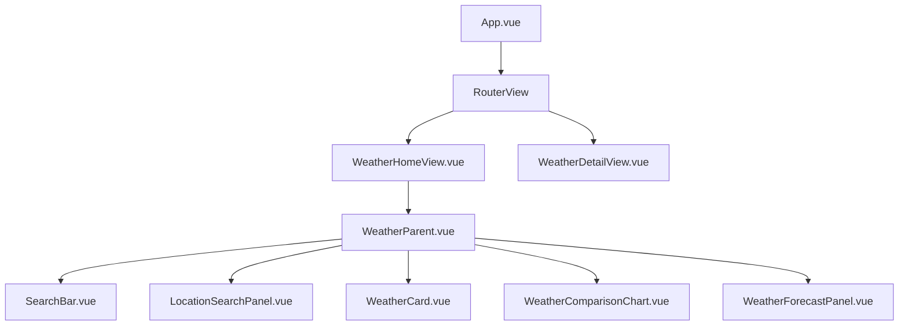
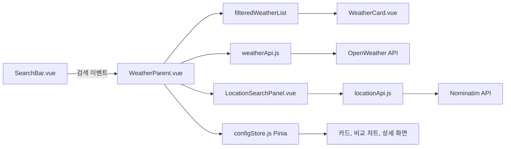
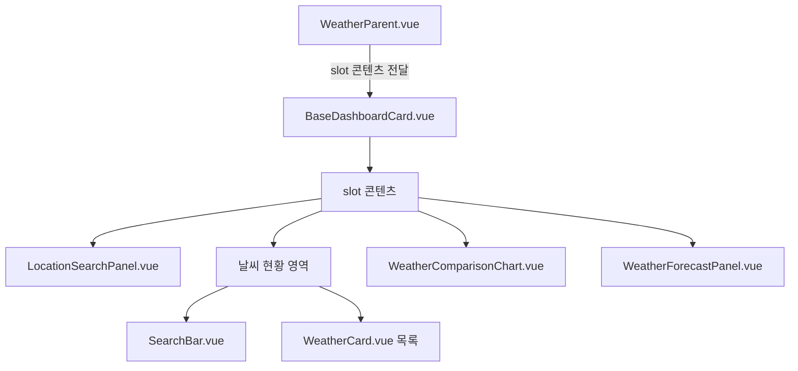
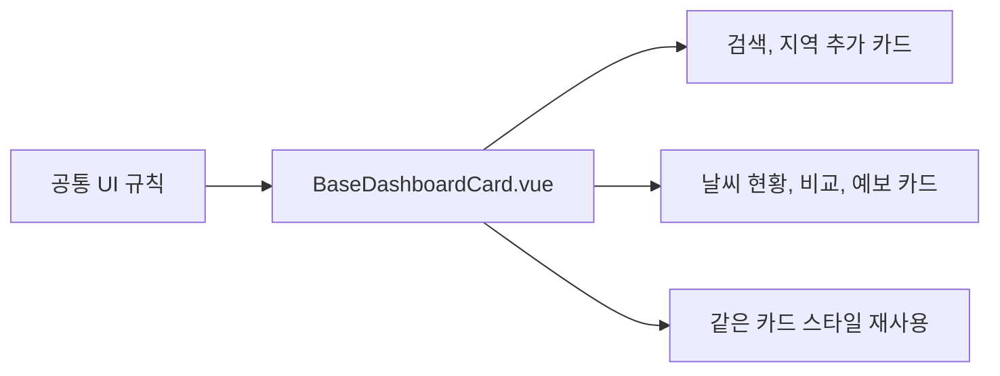
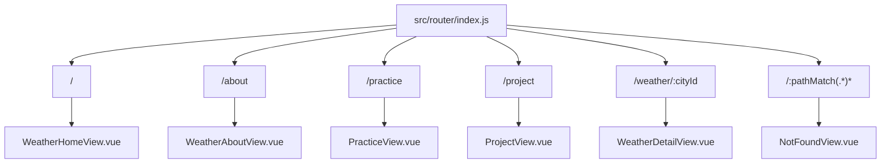

# skala-vue : Weather Dashboard

SKALA Frontend

실시간 날씨 정보를 확인하고, 원하는 지역을 추가해서 비교할 수 있는 Vue 날씨 대시보드입니다.

- Vue의 Composition API
- 컴포넌트 분리를 통한 최적화
- 외부 라이브러리 사용을 통한 개발 시간 단축

중점으로 SPA를 구현하는 것을 목표로 하여 구현했습니다!

!--  ESlint 검사 완료 // 변수 문제 없습니다 ^_^ --!

```bash
npm notice run skala-vue@0.0.0 lint
npm notice run run-s "lint:*"
npm notice run skala-vue@0.0.0 lint:oxlint
npm notice run oxlint . --fix
Found 0 warnings and 0 errors.
Finished in 20ms on 38 files with 114 rules using 10 threads.
npm notice run skala-vue@0.0.0 lint:eslint
npm notice run eslint . --fix --cache
```

## 배포 링크

[날씨 대시보드 바로가기](https://skala-vue-theta.vercel.app/)

## 주요 기능

#### Axios - API 처리 기능
- OpenWeather API를 이용한 현재 날씨와 5일 예보 조회
- 지역별 날씨 카드와 Google Maps 임베드 지도 연동

#### V-directive
- 도시 검색과 원하는 지역 추가
- 선택한 도시의 기온, 습도 비교

#### Pinia - 전역 상태 설정
- 라이트 모드, 다크 모드 전환
- 섭씨, 화씨 단위 전환

#### route - 웹페이지 링크 기능
- 상세 날씨 페이지, 프로젝트 타임라인, 404 페이지

#### 그외
- 즐겨찾기, 날씨 새로고침, 로딩 상태, 오류 메시지 처리

## 개발 순서

### 1. Vue 프로젝트와 SPA 구조 만들기

Vue와 Vite로 프로젝트를 만들었습니다.
`App.vue`에 기본 세팅을 진행했습니다.
페이지가 새로고침되지 않고 화면만 바뀌도록 SPA 구조를 잡았습니다.
(Vue.js의 기본 기능이긴 합니다.)

### 2. 반응형 상태 관리하기

`ref`로 검색어, 선택 도시, 날씨 목록, 로딩 상태를 관리했습니다.
`computed`로 검색 결과와 비교 데이터를 만들고,
`watch`와 `watchEffect`로 상태 변화를 확인했습니다.

### 3. 컴포넌트로 화면 나누기

Vue의 설계 철학에 맞게, 반복 사용되거나, 작은 부분으로 만들 수 있다면 전부 컴포넌트로 분리했습니다.

검색창, 날씨 카드, 공통 대시보드 박스, 지도, 비교 그래프를 각각의 컴포넌트로 분리했습니다.

부모와 자식 컴포넌트는 `props`와 `emits`로 통신하고,
공통 박스는 `slot`으로 재사용했습니다.

### 4. Element Plus UI 라이브러리 적용하기

외부 라이브러리 Element Plus 사용했습니다.

- 검색창은 `el-input`
- 정렬과 비교 항목은 `el-select`
- 날씨 카드는 `el-card`
- 날씨 상태는 `el-tag`
- 오류 메시지는 `el-alert`
- 로딩 상태는 `el-skeleton`,
- 검색 결과가 없을 때는 `el-empty`
- 버튼은 `el-button`

라운드 스타일을 적용했습니다.

### 5. Pinia로 전역 설정 관리하기

온도 단위와 화면 테마처럼 여러 화면에서 사용하는 상태를 전역 상태 관리 라이브러리 Pinia로 관리했습니다.

- `state`: `unit`, `theme`
- `getter`: `unitSymbol`, `isDarkMode`
- `action`: `toggleUnit`, `toggleTheme`

### 6. 날씨 API 연결하기

Axios를 사용해서 OpenWeather API에 좌표를 보내고 날씨 데이터를 받아왔습니다.
받아온 API 데이터는 화면에서 사용하기 쉽도록 날씨 객체 형태로 정리했습니다.

### 7. Vue Router로 페이지 연결하기

헤더 메뉴와 상세보기 버튼을 RouterLink, `router.push`로 연결했습니다.
상세 페이지는 동적 라우트로 도시 ID를 전달하고,
존재하지 않는 주소는 Catch-all 라우트에서 404 페이지로 처리했습니다.

### 8. 원하는 지역과 지도 기능 추가하기

주소를 검색하면 Nominatim(OpenStreetMap)에서 시, 구, 동과 위도, 경도 좌표를 받아옵니다.

선택한 지역은 날씨 목록에 추가하고 localStorage에 저장했습니다. (브라우저마다 별도의 데이터가 저장되도록 구현했습니다.)

카드를 선택하면 시, 구, 동과 위도, 경도 좌표를 기반으로 지도에 입력하여
해당 지역의 Google Maps 임베드 지도가 표시되도록 연결했습니다.

### 9. 배포

github에 올리고, Vercel에 배포했습니다.
마지막으로 API 키는 Vercel 환경변수로 분리해서 저장소에 직접 노출되지 않게 했습니다!

[날씨 대시보드 바로가기](https://skala-vue-theta.vercel.app/)


## 기술 스택

프론트엔트 프레임워크
- Vue 3, Vite


라이브러리
- Pinia
- Axios
- Vue Router

UI 라이브러리
- [Element-Plus](https://element-plus.org/en-US/)

API
- OpenWeather API
- Nominatim API
- Google Maps Embed API

호스팅
- Vercel

## 디렉토리 구조

### 1. 전체 폴더 구조



기본 폴더와 주요 역할을 간단하게 표현한 구조입니다.

### 2. 날씨 화면 컴포넌트 구조



### 3. 데이터와 API 흐름



### 4. `slot`과 컴포넌트 재사용

`BaseDashboardCard.vue`는 테두리, 배경, 여백처럼 공통 카드 UI를 담당합니다.

실제 화면 내용은 부모인 `WeatherParent.vue`가 slot으로 전달하므로, 
같은 카드 디자인을 여러 영역에서 재사용할 수 있습니다. 

이를 통해서 여러번 같은 디자인을 구현할 필요가 없었고, 시간을 단축할 수 있었습니다. 



### 홈화면 페이지 



### 5. 주요 파일 역할 보충 설명 

그외 추가 파일에 대한 설명입니다. 

| 위치 | 역할 |
| --- | --- |
| `src/main.js` | Vue 앱, Pinia, Vue Router, Element Plus를 등록하고 앱을 시작합니다. |
| `src/utils/weatherTheme.js` | 날씨 아이콘을 기준으로 화면 테마를 계산합니다. |
| `src/utils/debugLogger.js` | API 요청, 상태 변화, 사용자 행동을 확인하기 위한 로그를 관리합니다. |
| `src/components/exercise/LightMode.vue` | Pinia의 테마 상태를 이용해 라이트, 다크 모드를 전환합니다. |
| `src/components/exercise/UnitToggler.vue` | Pinia의 온도 단위를 섭씨, 화씨로 전환합니다. |
| `src/views/ProjectView.vue` | 프로젝트 구조, 변수, 컴포넌트 통신 과정을 아코디언 형태로 설명합니다. |
| `src/views/NotFoundView.vue` | 등록되지 않은 경로에서 404 안내 화면을 표시합니다. |
| `.env.example` | OpenWeather와 Google Maps API 키의 환경변수 이름을 안내합니다. |
| `vercel.json` | 배포 후 Vue Router 경로를 `index.html`로 연결합니다. |

### 6. 페이지 라우팅 구조 



이와 같은 연습을 통해서 SPA(Single Page Application)을 구현할 수 있었습니다. 


## 데이터 흐름

```text
사용자 입력
  ↓
SearchBar.vue
  ↓ update-query 이벤트
WeatherParent.vue의 searchQuery
  ↓
computed로 검색 결과 필터링
  ↓
WeatherCard.vue에 props로 전달
  ↓ 카드 선택
selectedCityInfo 변경
  ↓
LocationSearchPanel.vue 지도 변경
```

날씨 API 데이터의 흐름은 다음과 같습니다.

```text
WeatherParent.vue
  ↓ fetchWeatherList()
weatherApi.js
  ↓ Axios 요청
OpenWeather API
  ↓ 날씨 JSON 데이터
normalize 함수 : 제 웹페이지에 맞게 데이터를 변환하는 함수입니다.
  ↓
weatherList 반응형 상태
  ↓
WeatherCard, 비교 그래프, 상세 페이지에 표시합니다.
```

## 상태 저장과 예외 처리

### Pinia 전역 상태

`src/stores/configStore.js`의 `config` store에서 다음 값을 공유합니다.

- `unit`: 현재 온도 단위(`celsius` 또는 `fahrenheit`)
- `unitSymbol`: 화면에 표시할 `℃` 또는 `℉`
- `theme`: 현재 화면 테마(`light` 또는 `dark`)
- `isDarkMode`: 다크 모드 여부
- `toggleUnit()`, `toggleTheme()`: 설정을 변경하는 action

### localStorage 저장 데이터

브라우저를 새로고침해도 사용자 설정을 유지하기 위해 다음 데이터를 localStorage에 저장합니다.

- `skala-weather-custom-locations`: 사용자가 추가한 지역 목록
- `skala-weather-favorite-city-ids`: 즐겨찾기한 도시 ID 목록

일단 지역을 추가하면 재로딩을 하더라도 추가한 지역을 유지합니다.

### 로딩과 오류 상태

날씨 목록, 지역 검색, 5일 예보 요청은 각각 로딩 상태와 오류 메시지를 관리합니다.

API 키 누락, 네트워크 오류, 검색 결과 없음과 같은 상황은 화면의 안내 메시지로 표시합니다.
(API키를 제거하면 페이지 화면에서 쉽게 확인할 수 있습니다.)

## 로컬 실행

```bash
npm install
npm run dev
```

환경변수는 `.env.example`을 참고해 프로젝트 루트의 `.env` 파일에 설정합니다.

(API 키는 따로 올리지 않았습니다, 다운받아서 확인하신다면 개인키를 사용해주세요)
(.env.example은 작동하는 파일이 아닙니다. )

```bash
VITE_OPENWEATHER_API_KEY=발급받은_OpenWeather_API_키
VITE_GOOGLE_MAPS_API_KEY=발급받은_Google_Maps_API_키
```

배포용 빌드와 로컬 배포 미리보기는 다음 명령으로 실행합니다.

```bash
npm run build
npm run preview
```

## Vercel 배포 환경변수

Vercel 프로젝트의 `Settings -> Environment Variables`에 아래 변수 이름을 등록했습니다.

API 키 값은 Vercel 화면에서 직접 입력하고 저장소에는 작성하지 않았습니다.

(깃허브 레포에 API 키를 올리면 봇이 키를 다.. 가져가서 털릴 가능성이 있습니다.)

```text
VITE_OPENWEATHER_API_KEY = ~~ 키 값
VITE_GOOGLE_MAPS_API_KEY = ~~ 키 값
```
환경변수 설정에서 키 값을 넣었습니다

또한 `vercel.json`에서 모든 경로를 `index.html`로 연결해서,
Vercel에서 Vue Router 주소를 새로고침해도 정상적으로 페이지가 열리도록 설정했습니다.

## 앞으로 더 공부해야 할 것

1. JWT와 로그인 인증
  - 사용자 즐겨찾기, 추가 지역, 설정을 서버에 저장하는 기능을 구현해보고 싶습니다.
2. Vue Router의 동적 라우트와 네비게이션 가드
  - 로그인 한 사용자만 접근할 수 있는 페이지나 잘못된 도시 ID를 검사하는 기능을 만들고 싶습니다.
3. 테스트 코드와 성능 최적화
  - 이미지 최적화, 지연 로딩, API 캐싱을 배워서 화면 속도 개선과 같이 최적화를 해보고 싶습니다.
4. DB 시스템 연동
  - DB를 연동하면 다른 컴퓨터나 브라우저에서도 로그인 후 같은 데이터를 사용할 수 있는 기능을 구현해보고 싶습니다.
5. 개발 시간 단축 및 결과물 품질 향상을 위한 툴 공부
  - 생산성 향상을 위한 부가 툴이 뭐가 있는지 추가로 공부해보려 합니다.
  - 디자인 라이브러리만 써도 디자인에 들이는 시간이 줄어드는 게.. 좀 충격이었습니다.
  - (토큰도 좀 아낄 수 있지 않을까 합니다.)
